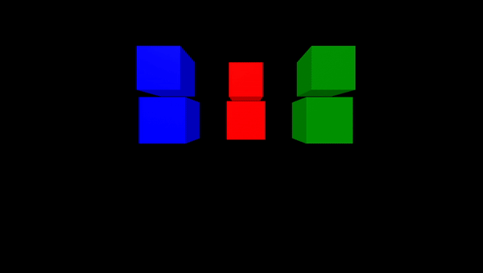
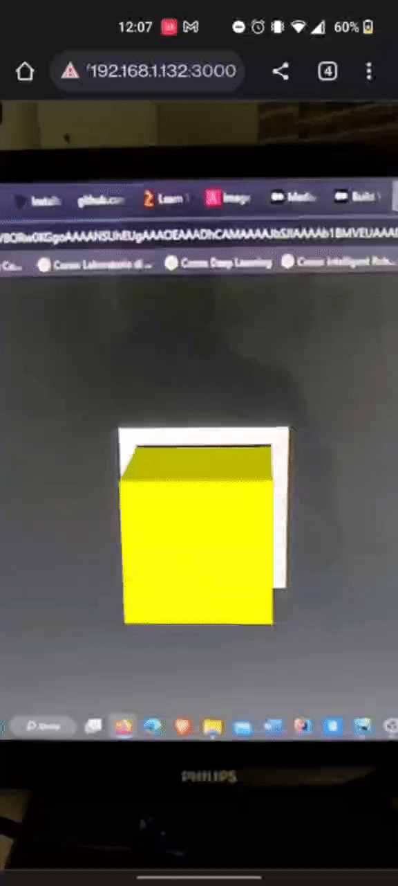

# WebXR-Three.js

This repository contains a set of examples showing how to create WebXR applications using Three.js

## A-Frame Interaction Gesture

This example shows how it is possible to use A-Frame and the super hands component to interact with different entities of the scene.

This example works also in WebXR only in VR mode.

You can find the example inside the directory `A-FrameInteractionGestures`.



|             | Version |
|-------------|---------|
| A-Frame     | 1.4.0   |
| super-hands | 3.0.3   |

## A-Frame Mouse Event

This example shows how to make a simple Web-Xr scene using A-Frame. This example also shows how you can get a simple interaction by means of the cursor and the event-set component, it works for both Augmented Reality and Virtual Reality.

You can find the example inside the directory `A-FrameMouseEvent`.


|             | Version |
|-------------|---------|
| A-Frame     | 1.4.0   |
| event_set   | 4.2.1   |

## Cube Spawn
This sample shows how Three.js can be used to create a WebXR application for Augmented Reality.

It works only for Augmented Reality.

You can find the example inside the directory `CubeSpawn`.


|           | Version |
|-----------|---------|
| Three.js  | 0.152.2 |

## Marker Based Augmented Reality

This example shows how it is possible to use Three.js to draw a marker in the real world and show static content above it.

This example only works for Augmented Reality.

You can find the example inside the directory `MarkerBasedAugmentedReality`.



|           | Version |
|-----------|---------|
| Three.js  | 0.152.2 |

To test the example this **image marker** was used:


## Transform Controls 

This example shows how it is possible to manipulate an element in Three.js by means of a gizmo.

However, manipulation works well in Virtual Reality environment but is not supported in Augmented Reality.

You can find the example inside the directory `TransformControls-ThreeJS`.


|           | Version |
|-----------|---------|
| Three.js  | 0.152.2 |

## How to run the examples

Since WebXR only works on secure sites (https) or localhost, in order to launch the application with a specific IP address, you must associate a certificate to the web page. To do this you can use openssl and execute the following commands in the application directory:

```shell
openssl genrsa -out private_key.pem
```

```shell
openssl req -new -key private_key.pem -out csr.pem
```

```shell
openssl x509 -req -days 9999 -in csr.pem -signkey private_key.pem -out cert.pem
```

Once you have created the certificate you can launch the application by running the following commands:

```shell
npm install
```

```shell
node app.js
```